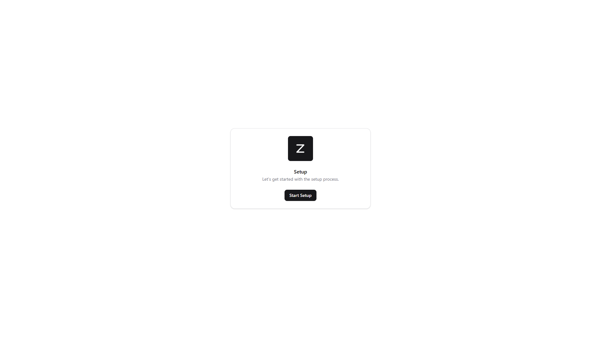
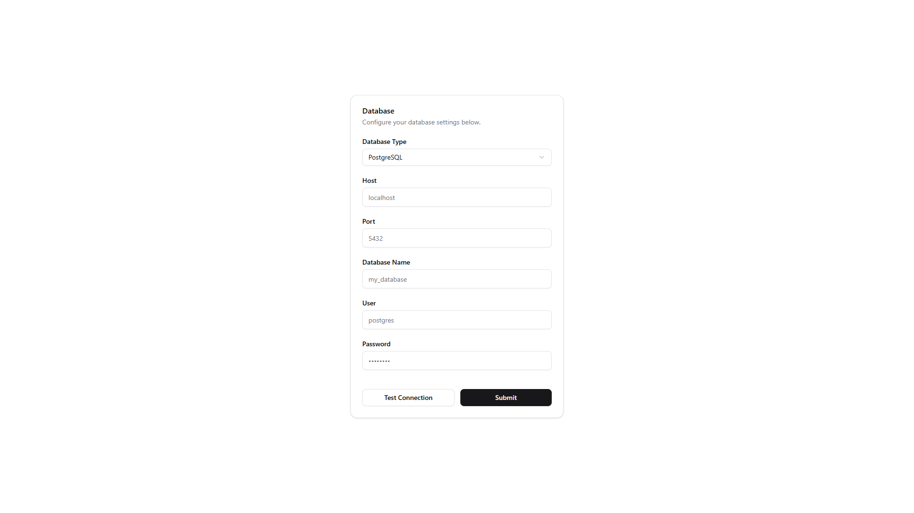
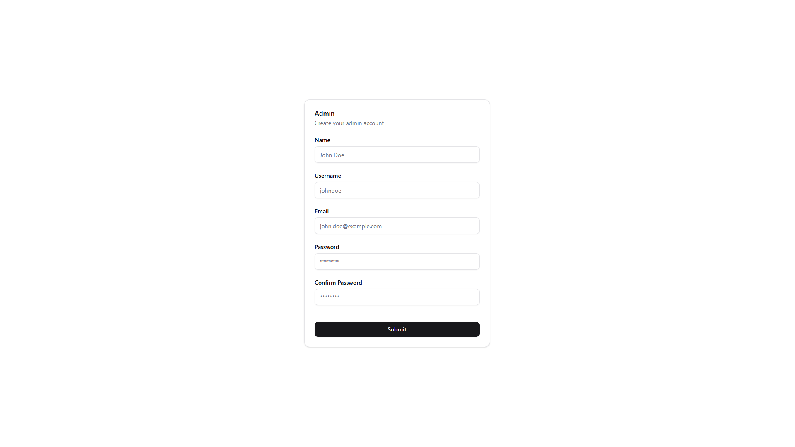
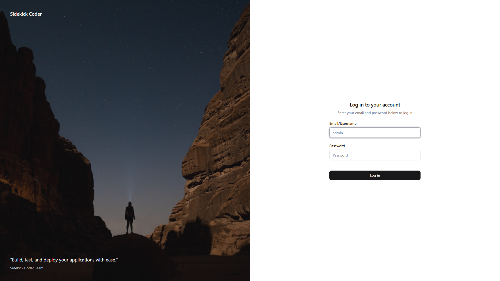

# Setup

Setup pages are an easy way create config json files for your project to run normally, for example the database step will generate a `config/database.json` file with your database connection details.

## Database

In this step you can configure your database connection. You can choose between different database types like MySQL, PostgreSQL, SQLite, etc. Fill in the required fields such as host, port, username, password, and database name.

## User 

In this step you can create the initial admin user for your application. Fill in the username, email, and password fields to set up your admin account.

For reference an admin user is a user that has a permision with `action = manage` and `subject = all` in the `permissions` table.

## Login

After completing the setup steps, you can log in to your application using the admin user credentials you just created.

