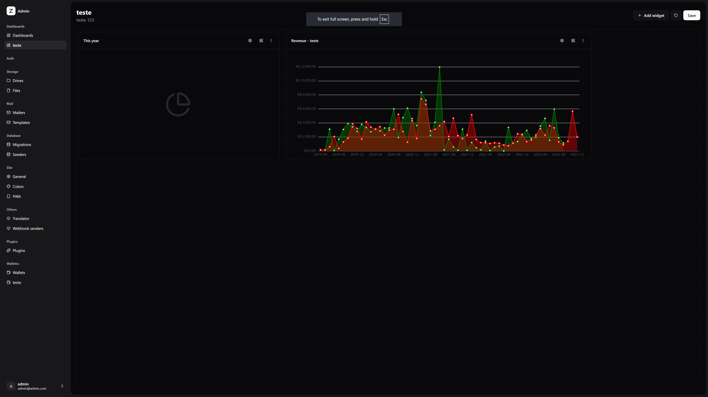
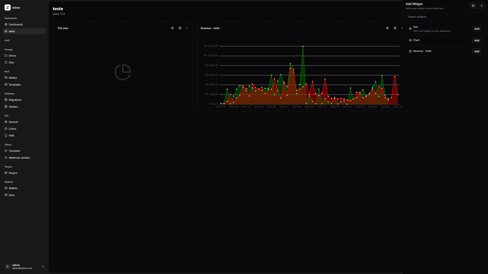

# Dashboards

Dashboards are pages in the app with a collection of widgets that can be used to display data and interact with the app. 

Plugins can register widgets to be used in the dashboards and users can use this widgets to create their own dashboards.



## Widgets

To create a widget you will need to create a vue render component, a definition class and register the definition in the `dashboardRegistry` service.


### Widget definition

This is a class that defines the widget, it contains the name, description, icon and the render component of the widget. 

```ts
import { defineAsyncComponent } from 'vue'
import { DashboardWidgetDefinition } from '@sidekick-coder/zenith-kit/client'

const DashboardWidgetDefinitionRenderText = defineAsyncComponent(
    () => import('#client/components/DashboardWidgetRenderText.vue')
)

class DashboardWidgetDefinitionText extends DashboardWidgetDefinition {
    constructor() {
        super()
        this.id = 'text'
        this.name = 'Text'
        this.description = $t('Add a text widget to your dashboard.')
    }

    public component() {
        return DashboardWidgetDefinitionRenderText
    }
}
```

You can also use `actions` method to define buttons that will be displayed in the widget settings, for example to change the displayed text

```ts
// helper settings component
import { DashboardWidgetActionSetting } from '@sidekick-coder/zenith-kit/components'
import { defineFormFields } from '@sidekick-coder/zenith-kit/client'

class DashboardWidgetDefinitionText extends DashboardWidgetDefinition {
    public actions() {
        const fields = defineFormFields({
            text: {
                component: 'textarea',
                label: $t('Text'),
                placeholder: $t('Enter your text here...'),
            },
        })

        return [
            {
                props: { fields },
                component: DashboardWidgetActionSetting,
            }
        ]
    }
}
```

Now you just need to register the definition in the `dashboardRegistry`

```ts
import { dashboardRegistry } from '@sidekick-coder/zenith-kit/client' 

dashboardRegistry.register(new DashboardWidgetDefinitionText())
```

Now the widget will be available in the dashboard editor and users can add it to their dashboards.


